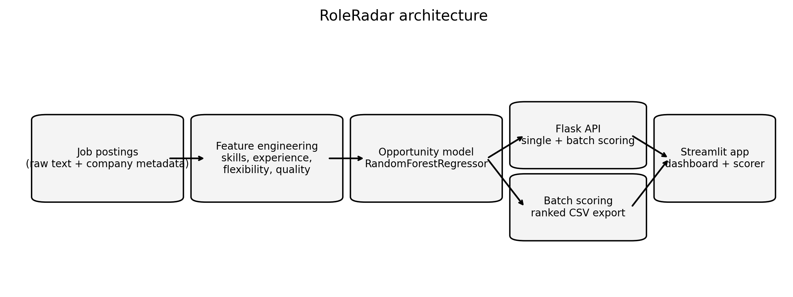
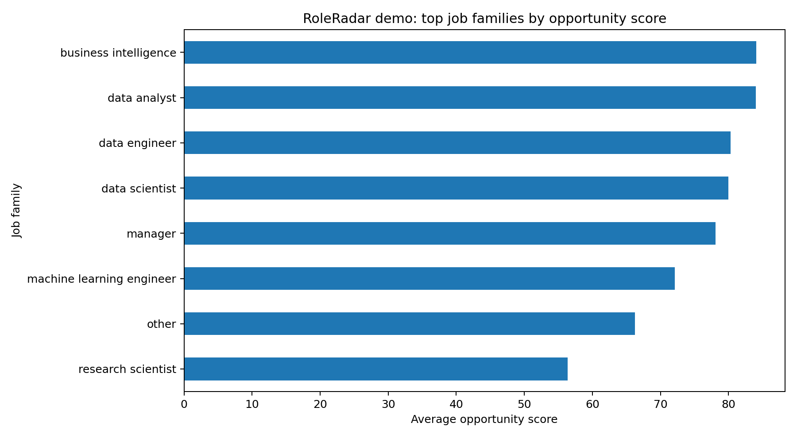
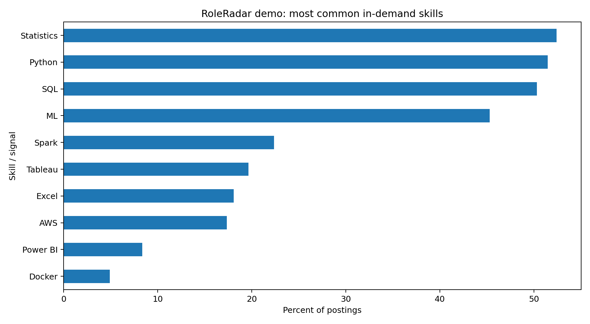
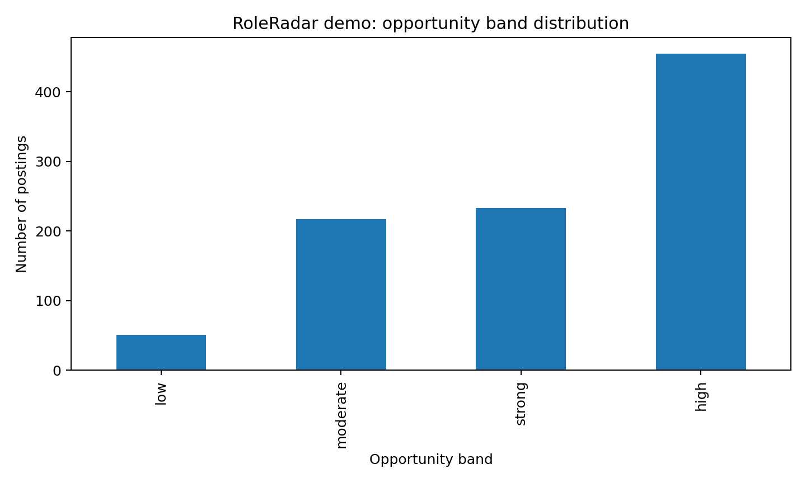

# RoleRadar — Explainable Job Market Intelligence

RoleRadar is a portfolio-ready analytics product that converts raw job postings into **actionable hiring intelligence**.

Instead of predicting salary, the platform scores each posting on:
- **Opportunity quality**
- **Barrier to entry**
- **Tool stack relevance**
- **Workplace flexibility**
- **Business-facing hiring signals**

It follows a realistic analytics workflow:

**scrape → clean → score → explain → serve → explore**

---

## Why this project is stronger than a basic tutorial
RoleRadar is designed to behave like a lightweight analytics product rather than a one-off notebook.

It includes:
- feature engineering from unstructured job text
- an opportunity scoring model
- a Flask scoring API with metadata and batch scoring
- a Streamlit dashboard for interactive exploration
- reusable batch scoring for portfolio demos
- validation tests for core feature logic
- recruiter-friendly documentation and demo assets

---

## Product use cases
- prioritize which jobs to apply to first
- analyze employer demand for modern data skills
- compare postings by accessibility and market relevance
- demonstrate ML + analytics engineering + product thinking in one repo

---

## Demo assets

### Architecture


### Sample outputs




These images are included so a recruiter can understand the project before running the code.

---

## What makes the score useful
The score is **not** intended to predict whether someone will get hired. It is a decision-support signal that estimates how attractive and accessible a posting appears based on:
- company context
- stack relevance
- flexibility
- business exposure
- entry barriers
- posting clarity

That makes RoleRadar more credible than a simple "good job / bad job" classifier.

---

## Repository structure
- `data_collection.py` — configure scraping across multiple role families
- `data_cleaning.py` — build the scored market dataset
- `job_market_intelligence.py` — reusable feature engineering, scoring logic, summaries, and top score drivers
- `model_building.py` — train and export the opportunity model
- `batch_score.py` — score many postings at once and export a ranked CSV
- `streamlit_app.py` — interactive dashboard for exploration and single-posting scoring
- `FlaskAPI/app.py` — API with health, metadata, single prediction, and batch prediction
- `tests/test_feature_engineering.py` — sanity tests for core logic
- `docs/portfolio_story.md` — interview and resume framing
- `docs/demo_walkthrough.md` — live demo guide

---

## Core signals extracted
### Technical stack
Python, SQL, Excel, Tableau, Power BI, AWS, Spark, Snowflake, dbt, Airflow, Docker, Kubernetes

### Advanced analytics signals
Machine learning, experimentation, ETL, streaming, KPI/dashboard delivery, Generative AI / LLM language

### Accessibility signals
Years of experience, entry-level language, advanced degree language, seniority cues

### Business signals
Stakeholder exposure, leadership language, role family, company context, revenue and size proxies

---

## Local setup
```bash
python -m venv .venv
```

Windows PowerShell:
```powershell
.\.venv\Scripts\Activate.ps1
pip install -r requirements.txt
```

macOS / Linux:
```bash
source .venv/bin/activate
pip install -r requirements.txt
```

---

## Typical workflow
### 1. Build the cleaned dataset
```bash
python data_cleaning.py
```

### 2. Train the model
```bash
python model_building.py
```

### 3. Launch the API
```bash
cd FlaskAPI
python app.py
```

### 4. Launch the dashboard
```bash
streamlit run streamlit_app.py
```

### 5. Batch-score postings
```bash
python batch_score.py
```

### 6. Run tests
```bash
pytest
```

---

## API routes
- `GET /health`
- `GET /metadata`
- `POST /predict`
- `POST /predict_batch`

---

## Example API response
```json
{
  "project": "roleradar",
  "predicted_opportunity_score": 82.4,
  "opportunity_band": "high",
  "summary": "This mid-level product analyst posting shows demand for Python, SQL, Tableau, and Experimentation and lands in the high opportunity band.",
  "market_summary": {
    "job_family": "product analyst",
    "seniority": "mid",
    "skill_count": 7,
    "years_experience": 2,
    "remote": false,
    "hybrid": true,
    "high_opportunity_role": true
  },
  "detected_skills": ["Python", "SQL", "Tableau", "Experimentation", "Statistics", "Generative AI"],
  "signal_snapshot": {
    "core_stack_score": 15.0,
    "modern_stack_score": 12.0,
    "posting_quality_score": 24.7,
    "entry_access_score": 10.0,
    "remote_flex_score": 4.0
  },
  "top_drivers": [
    {"signal": "Posting quality", "direction": "positive", "impact": 24.7, "value": 24.7},
    {"signal": "Core analytics stack", "direction": "positive", "impact": 15.0, "value": 15.0},
    {"signal": "Modern data tooling", "direction": "positive", "impact": 12.0, "value": 12.0}
  ],
  "explanations": [
    "Posting references newer cloud or platform tooling, which strengthens market relevance.",
    "Hybrid setup adds flexibility without being fully on-site.",
    "Experience expectations look relatively accessible for early-career applicants."
  ]
}
```

---

## Suggested resume framing
> Built **RoleRadar**, an explainable job market intelligence platform that transformed raw job postings into ranked opportunity scores using text-derived hiring signals, a machine learning model, a Flask API, batch scoring workflows, and a Streamlit dashboard.

---

## Interview framing
### Why this is more compelling than a salary model
A salary estimate is narrow. RoleRadar supports broader use cases:
- applicant prioritization
- hiring market analysis
- role comparison
- skill trend interpretation

### What makes the project feel product-oriented
- single-posting and batch scoring
- dashboard exploration
- API-first delivery
- explainable score drivers
- reusable docs and demo workflow

---

## Next expansion ideas
- SHAP-based feature attributions
- scheduled refresh pipeline
- PostgreSQL storage layer
- Docker deployment
- cloud-hosted dashboard
